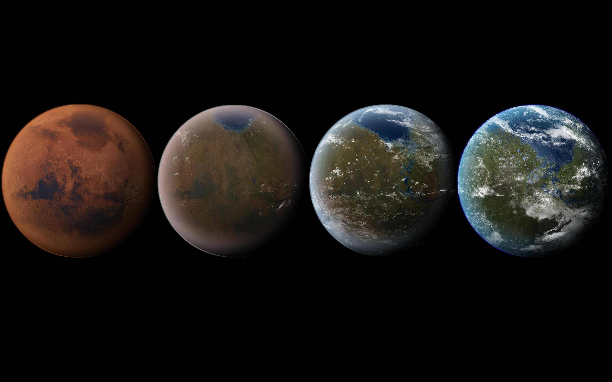

# terraformer 
A go program that generates terraform files using go templates



## installation (osx)

```
brew install sklevenz/skl/terraformer 
```

## usage

`terraformer [template] [config]` 

- `template` is a go template file path 
- `config` is a yaml file path

The config.yaml will be read into a hashmap and can then be processed within the go template file.

## motivation

Terraform has its own proprietary programming and template syntax. Many infrastructure projects start small and often grow after a while. Then the complexity of a proprietary technology could become an issue. 

The thesis is that "standard" programming technologies can handle this complexity better. Example technologies are Ruby, Python, node.js ... Standard means there are simply more developers familiar with this technologies. That's it.

This solution uses go as technology and the go templates. Go, because of the single binary is simple to use. 

## concept

The idea is:
- have simple template files
- have a context yaml file containing variable data 
- generate a terraform file
- apply terraform file to the infrastructure

The template file should be simple. Ideally it is a flat list of resources. Programming logic and variable substitution is done by go templating.
The context is a single source of data. Basically it is a yaml data structure which is accessible in the go template as `{{.}}`. This context is maybe generated as well and get's data from all kind of sources. Static configuration, calculations, environment variables, other yaml files, terraform state files, etc. Here we don't care about how this is done. 
The result is a main.tf containing all resources and all data. Apply this with terraform.


## best practices

Data sources, variable, loops, dependencies, modules ... all of this makes maintenance of terraform difficult. We recommend the following

- create more but smaller templates 
- deploy in chunks and have a defined order
- practice TDI (test driven infrastructure)
  - create a test account
  - deploy form scratch, update and delete
    


## examples

terraform template file

```
provider "aws" {
  access_key = "{{ .context.access_key }}"
  secret_key = "{{ .context.secret_key }}"
  region     = "us-west-1"
}
```

context yaml file

```
context:
  access_key: 123
  secret_key: "abc"
```

## features

| feature | description | example |
|---------|-------------|---------|
| tfStringListFormater | formats a list with quoted elements | [1,2,3] -> ["1","2","3"] |
| more to come | provide a pull request | f(x)  |

## try out 
```
go run terraformer.go ./examples/aws/tf.template ./examples/aws/context.yml
```

## build

```
go test
go build
```


